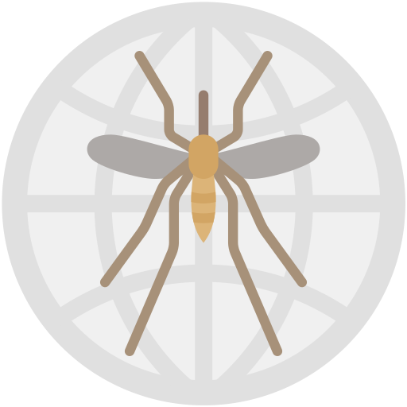
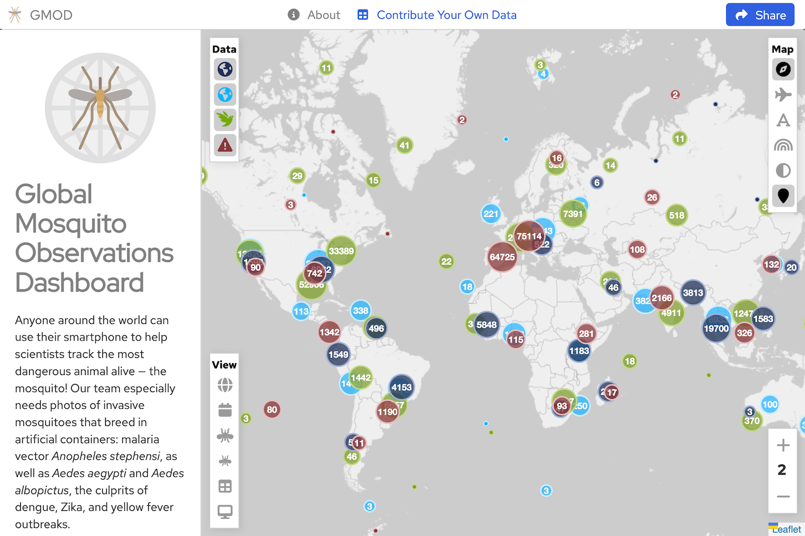
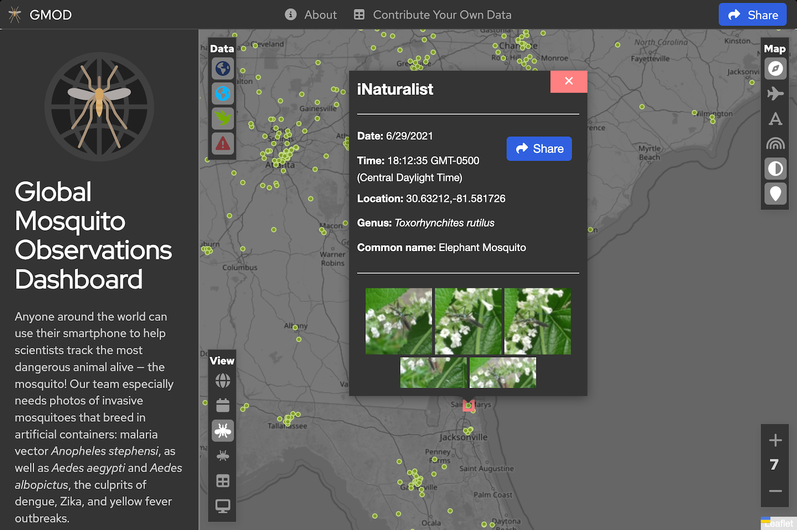
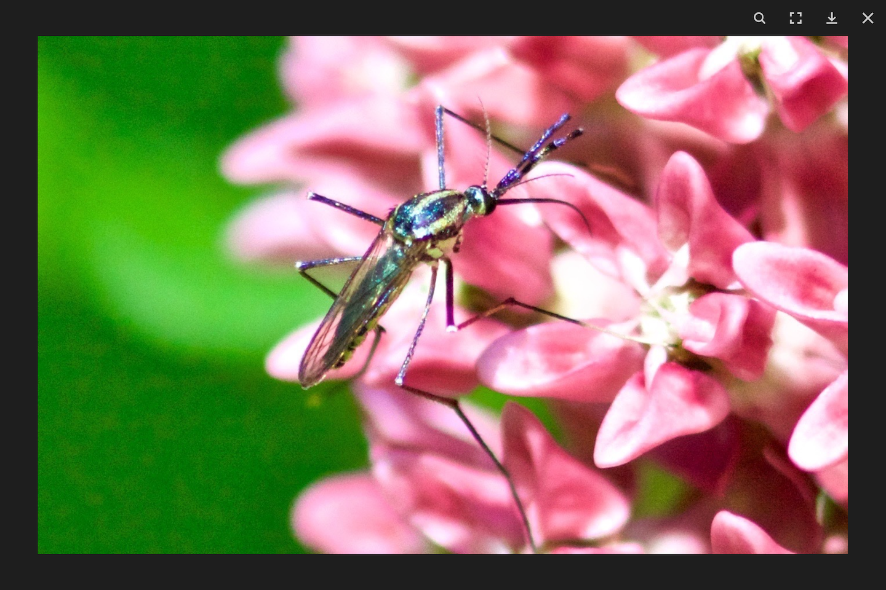
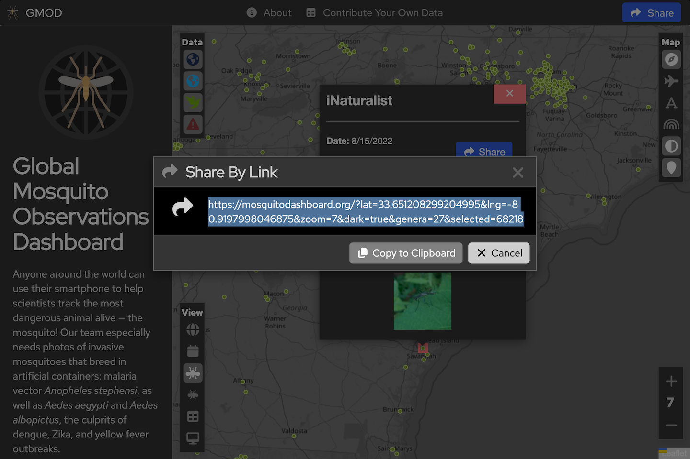

<p align="center">
  <div align="center">
    
  </div>
</p>

# Global Mosquito Dashboard

The Global Mosquito Dashboard is tool for bringing together and displaying mosquito observation daata from a variety of citizen science data sources in on place in order to provide a more global and wholistic view of mosquito observations.


*Global View*


*Observation View*


*Slide Show View*


*Share By Link View*

# Capabilities
The GMOD dashboard includes the following features.

### Data Sources
The Global Mosquito Dashboard integrates data from a number of external data sources:

- [GLOBE Habitat Mapper](https://observer.globe.gov/do-globe-observer/mosquito-habitats)
- [GLOBE Land Cover](https://observer.globe.gov/do-globe-observer/land-cover)
- [iNaturalist](https://www.inaturalist.org)
- [Mosquito Alert](https://www.mosquitoalert.com)

### Viewing
- View locations of mosquito observations on a map.
- View data and metadata for individual observations.
- View full screen slide shows of observation imagery.
- Select from a variety of base maps.
- Choose between light or dark mode.
- Show monochrome or colored base maps to highlight the markers or the geography.

### Filtering:
- Filter observations by:
    - Data Source
    - Country
    - Date / Time
    - Genera
    - Species

### Collaboration
- Easily share observations and map views with others by clicking the "Share" button.  This will create a web link that you can share with others that captures your current view and application settings.

## Architecture

This application is composed of three main parts:

### 1. Scraper
The scraper pulls data from the citizen science platforms into a database where it can be used by this applicsation. Typically, the scraper is configured to perform a period scraper (once per day) to keep the database up to date.

### 2. Server
The server provides observation data to the client application.  It listens for http requests, pulls the data from the SQL database, and provides the data in the format needed by the client.

### 3. Client
The client is the dashboard front end application that users see in their web browser.   It displays a map view, requests data from the server and displays the data in a visual form.

## Installation

### 1. Docker Installation
The application has been "Dockerized" to make it easy to install and run.   To run the application, you must first have Docker installed on your machine / web server and then you can just run the following command to run the application:

```
sh run.sh
```

After running this command, you should be able to view the application in your web browser by going to the address: "localhost".

## License

Distributed under the MIT License. See `LICENSE` for more information.

## Credits

This project was made possible by a grant from the National Science Foundation - [Award #2014547](https://www.nsf.gov/awardsearch/show-award/?AWD_ID=2014547)

## Contact

Johnny Ulemen - Assistant Professor, University of Wisconsin-Madison
(mailto:uelmen@wisc.edu)

Ryan Carney - Associate Professor, Department of Integrativie Biology, University of South Florida
(mailto:ryancarney@usf.edu)

Abe Megahed - Research Software Engineer, Data Science Institute, University of Wisconsin-Madison
(mailto:amegahed@wisc.edu)

## Acknowledgements

I would also like to thank:
Dr. Rusty Low - Deputy Director, GLOBE Observation Program, which provided the data without which this dashboard could not exist.